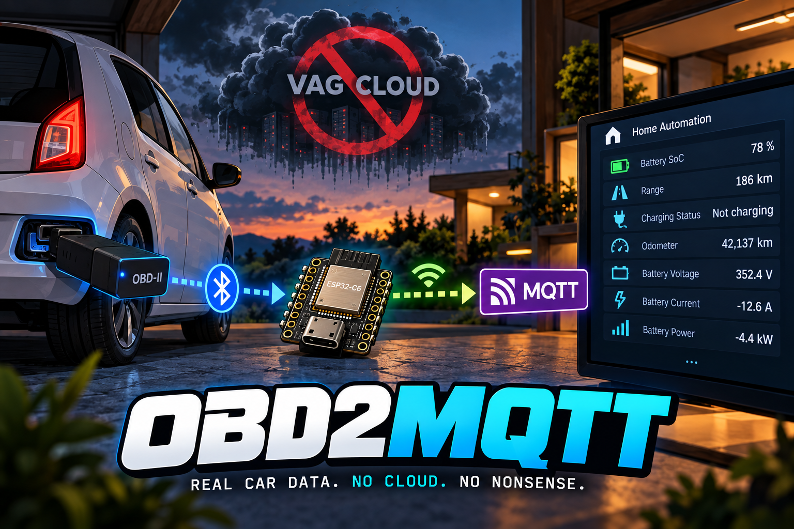
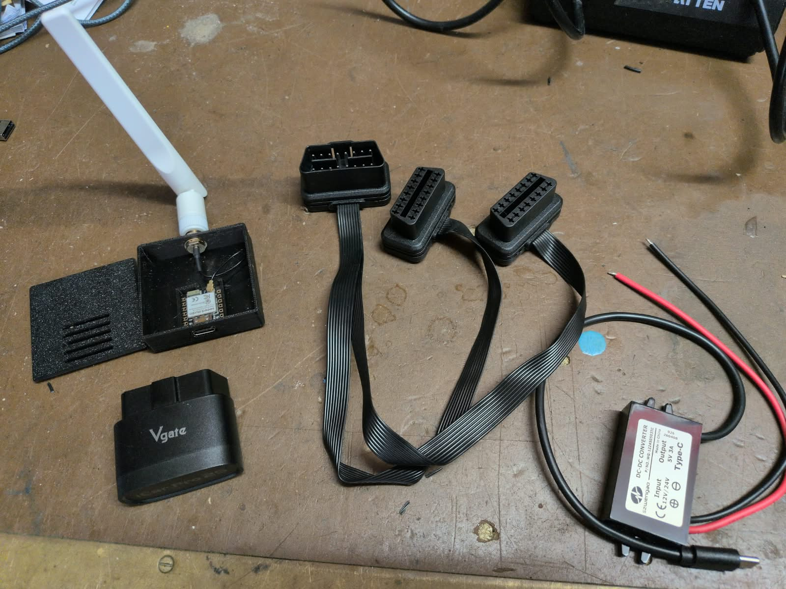
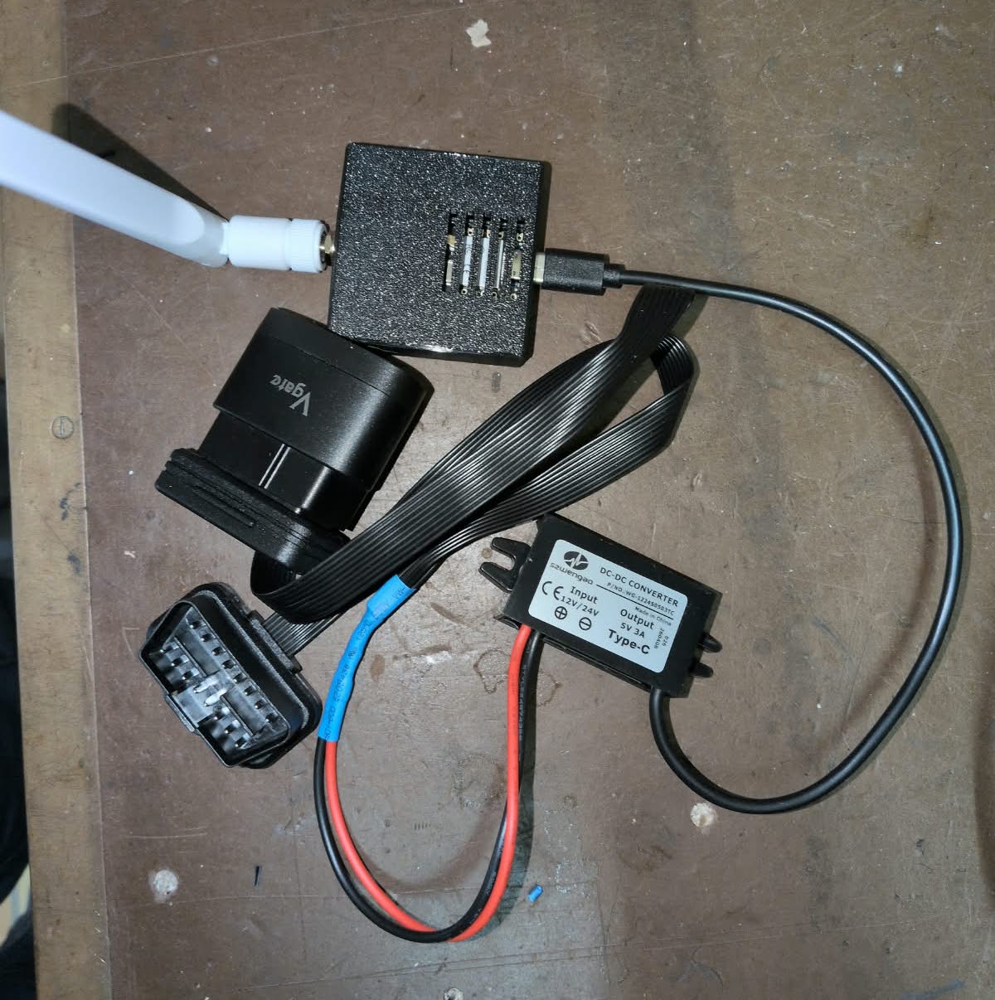
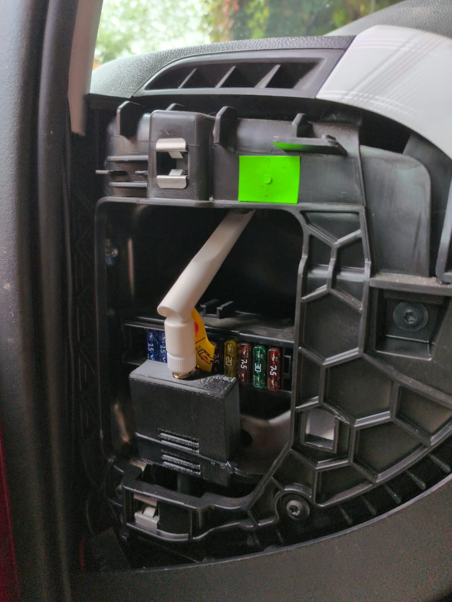

# OBD2MQTT



For years, I used the excellent [ioBroker VW Connect adapter by TA2k](https://github.com/TA2k/ioBroker.vw-connect) to integrate my SEAT Mii Electric into my home automation.

And to be clear right from the start: the adapter was not the problem. TA2k did a great job working with what Volkswagen provided.

The problem was Volkswagen.

The VW/SEAT/Škoda backend was never exactly a shining example of reliable software engineering. Vehicle data could arrive with ridiculous delays, requests would randomly fail, authentication would break, and getting something as basic as the current state of charge often felt less like querying a connected car and more like sending a postcard to Wolfsburg and hoping somebody eventually mailed an answer back.

Still, it mostly worked. And for years, projects like ioBroker, Home Assistant, evcc and others managed to build useful integrations around Volkswagen's undocumented app infrastructure.

Then Volkswagen decided to shut that door.

In 2026, VAG effectively killed the authentication/API paths these community integrations had been using. Yes, these were undocumented interfaces intended for Volkswagen's own apps rather than an officially supported public API. Volkswagen is perfectly entitled to secure and change its internal infrastructure.

But that's not really the point.

The absurd part is what came afterwards.

Instead of giving owners a proper, direct, documented and reasonably real-time API for data generated by a vehicle they actually own, Volkswagen's answer is essentially a mixture of partner APIs, the EU Data Act infrastructure, and third-party services. The official Data Act route can provide vehicle data, but for home automation the latency and update behaviour can make it a rather poor replacement for direct vehicle access.

Apparently, in 2026, asking a €20,000+ computer on wheels for its battery percentage through your own software is still an unreasonable request unless the Volkswagen Group approves the software sitting in between.

So I stopped trying to make Volkswagen's cloud cooperate.

I built my own solution.

OBD2MQTT reads a SEAT Mii Electric, VW e-Up Gen2 or Škoda Citigo-e iV directly through a Vgate iCar Pro 2S BLE adapter. It publishes vehicle telemetry over Wi-Fi and MQTT without relying on Volkswagen's cloud services. The firmware targets a Seeed Studio XIAO ESP32-C6, wakes every 15 minutes, connects to the configured BLE dongle, reads diagnostic values, publishes them when Wi-Fi and MQTT are available, and returns to deep sleep.

The project uses read-only diagnostic requests. The two Vgate dongles have the same advertised BLE name, so each installation must be configured with the MAC address of the matching dongle.

## Scope and extensions

This implementation has been developed and tested for the SEAT Mii Electric. The ECU addresses, diagnostic identifiers and value decoding are specific to this vehicle family. Other cars may use different control units, identifiers, BLE adapters or diagnostic protocols and will likely require code and configuration changes.

OBD2MQTT is intended as a practical starting point for personal projects and extensions. Add support for other vehicles, sensors, MQTT formats, dashboards or automation systems as needed. The project is fully vibecoded: use the code, logs and documented assumptions as a starting point, verify everything on your own hardware, and improve it for your use case.

## Required hardware



You need:

- a Seeed Studio XIAO ESP32-C6;
- a suitable Wi-Fi antenna for the ESP32-C6;
- a Vgate iCar Pro 2S BLE OBD adapter;
- a stable power supply for the ESP32-C6; and
- preferably an OBD2 Y-cable.

An OBD2 Y-cable makes it possible to keep the Vgate connected and power the ESP separately. On the OBD2 connector, pin 4 is Ground and pin 16 is permanent 12 V. These can be connected to a 12 V USB adapter for powering the ESP32. Check the wiring and polarity carefully before connecting anything to the vehicle.

The firmware targets the Seeed Studio XIAO ESP32-C6 and is designed for permanent power. Each cycle scans for the configured BLE dongle, reads the vehicle, publishes retained MQTT values when Wi-Fi is available, then enters deep sleep for 15 minutes. Only the timer wakes the controller.

## Assembly and installation

The assembled electronics use the XIAO ESP32-C6, its antenna, the Vgate adapter and the OBD2 Y-cable together with a 12 V to USB converter:



The setup can be installed in the vehicle near the OBD connector. Secure all parts so that they cannot interfere with the pedals, steering or other moving components:



## Setup

Copy the example configuration and edit it for the vehicle:

```sh
cp src/config.example.h src/config.h
```

Set the Wi-Fi and MQTT credentials, the MQTT topic prefix, and the BLE MAC address of the matching OBD dongle. `src/config.h` is ignored by Git and must never be committed.

The two dongles have the same advertised name, so the MAC address is the vehicle identity. Keep one configuration per controller and vehicle.

## Build and flash

Install PlatformIO, connect the XIAO ESP32-C6, and run:

```sh
pio run -e xiao_esp32c6
pio run -e xiao_esp32c6 -t upload
pio device monitor --baud 115200
```

The serial log reports BLE/ELM327 activity, telemetry, MQTT results and `SLEEP seconds=900`.

## MQTT

The configured status topic receives `ok` or `noOBDdata`. Individual retained values are published below the configured data prefix, including SOC, odometer, readiness, charging state, range, battery voltage/current/power and charge time where available.

## Safety and limitations

The firmware uses read-only diagnostic requests. It does not clear faults, code control units, start vehicle routines or write vehicle settings. Some optional charger values may report `NO DATA`; those fields remain unavailable rather than being inferred.

This project is provided as-is. I do not assume any warranty or liability for damage to the vehicle, electronics, wiring, USB adapter, OBD interface, ESP32, software, MQTT installation or any other equipment. You are responsible for checking the wiring, power supply, electrical protection and installation yourself. Use the project at your own risk and test it before leaving it connected to a vehicle unattended.

## License

OBD2MQTT is released under the [MIT License](LICENSE).
